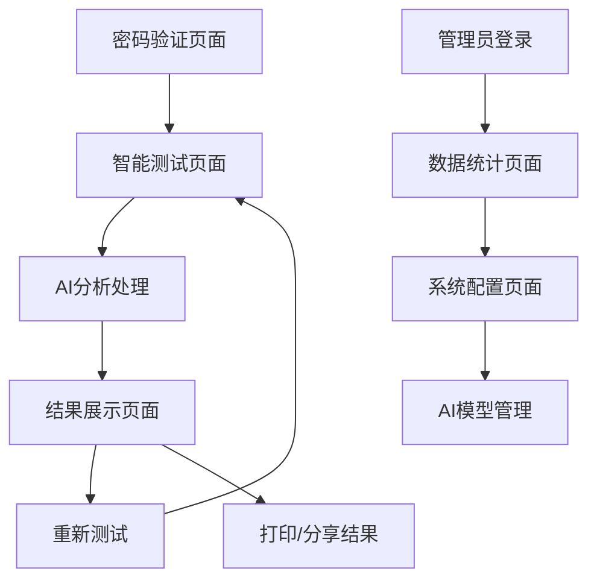

## 1. Product Overview

基于AI大模型的复读提分预测系统优化项目，旨在将现有的固定算法评估系统升级为智能化的AI分析平台。通过集成Qwen/Qwen3-8B模型，实现对用户复读适配性的深度分析，提供个性化的提分预测和多维度针对性建议。

项目将解决现有系统分析维度单一、建议缺乏针对性的问题，为复读生提供更科学、更个性化的决策支持，提升复读成功率和用户满意度。

## 2. Core Features

### 2.1 User Roles

| Role | Registration Method | Core Permissions |
|------|---------------------|------------------|
| 普通用户 | 密码验证访问 | 完成测试、查看基础分析结果 |
| 管理员 | 后台登录 | 查看用户数据、系统配置、API管理 |

### 2.2 Feature Module

我们的AI复读提分预测系统包含以下主要页面：

1. **登录页面**: 密码验证、用户身份确认
2. **智能测试页面**: 30题问卷、实时进度跟踪、AI数据收集
3. **AI分析结果页面**: 智能分数预测、多维度分析报告、个性化建议
4. **管理后台页面**: 用户数据统计、AI模型配置、系统监控

### 2.3 Page Details

| Page Name | Module Name | Feature description |
|-----------|-------------|---------------------|
| 登录页面 | 身份验证模块 | 验证访问密码，记录用户访问，跳转到测试页面 |
| 智能测试页面 | 问卷系统 | 展示30道测试题，收集用户答题数据，实时更新进度条 |
| 智能测试页面 | 数据收集模块 | 记录答题时间、修改次数等行为数据，为AI分析提供更多维度信息 |
| AI分析结果页面 | AI分析引擎 | 调用Qwen模型分析用户数据，生成个性化分数预测和建议 |
| AI分析结果页面 | 结果展示模块 | 多维度可视化展示分析结果，包括学习基础、心理素质、方法能力、目标动机四个维度 |
| AI分析结果页面 | 建议生成模块 | 基于AI分析生成针对性学习建议、心理调适方案、时间规划等 |
| 管理后台页面 | 数据统计模块 | 展示用户访问量、测试完成率、AI调用统计等关键指标 |
| 管理后台页面 | 系统配置模块 | AI模型参数调整、API密钥管理、系统维护功能 |

## 3. Core Process

**用户测试流程：**
用户通过密码验证进入系统 → 完成30道智能测试题 → 系统收集答题数据和行为特征 → AI模型深度分析用户特征 → 生成个性化分数预测和多维度建议 → 用户查看详细分析报告

**管理员流程：**
管理员登录后台 → 查看用户数据统计 → 监控AI模型调用情况 → 调整系统参数 → 维护系统稳定运行

## 4. User Interface Design

### 4.1 Design Style

- **主色调**: 蓝色系 (#3b82f6, #60a5fa) 体现科技感和专业性
- **辅助色**: 灰色系 (#f8fafc, #e2e8f0) 保持简洁清爽
- **按钮样式**: 圆角渐变按钮，悬停效果增强交互体验
- **字体**: Arial字体，桌面端16px，移动端14px
- **布局风格**: 卡片式布局，毛玻璃效果背景，响应式设计
- **图标风格**: 简约线性图标，配合数据可视化图表

### 4.2 Page Design Overview

| Page Name | Module Name | UI Elements |
|-----------|-------------|-------------|
| 登录页面 | 身份验证区域 | 毛玻璃卡片容器，渐变背景，浮动气泡动画，密码输入框带焦点效果 |
| 智能测试页面 | 问卷展示区域 | 分段式问卷布局，圆形选项按钮，实时进度条，平滑滚动动画 |
| AI分析结果页面 | 分数展示区域 | 大号分数显示，渐变背景卡片，旋转动画效果，立体阴影 |
| AI分析结果页面 | 维度分析区域 | 四象限网格布局，彩色进度条，悬停放大效果，数据可视化图表 |
| AI分析结果页面 | 建议展示区域 | 分类标签设计，折叠展开交互，高亮关键建议，打印友好样式 |
| 管理后台页面 | 数据统计区域 | 仪表盘风格，实时数据更新，图表可视化，响应式网格布局 |

### 4.3 Responsiveness

系统采用移动优先的响应式设计，支持桌面端、平板和手机端访问。针对触屏设备优化了按钮大小和交互方式，确保在各种设备上都有良好的用户体验。特别优化了AI分析结果的展示效果，在小屏幕上采用垂直堆叠布局，保持信息的可读性。