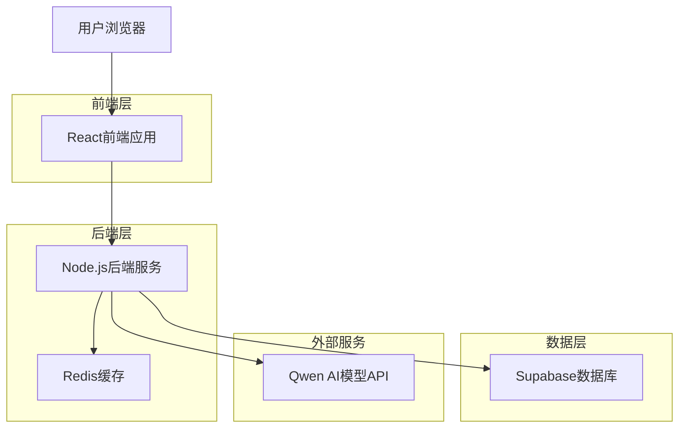
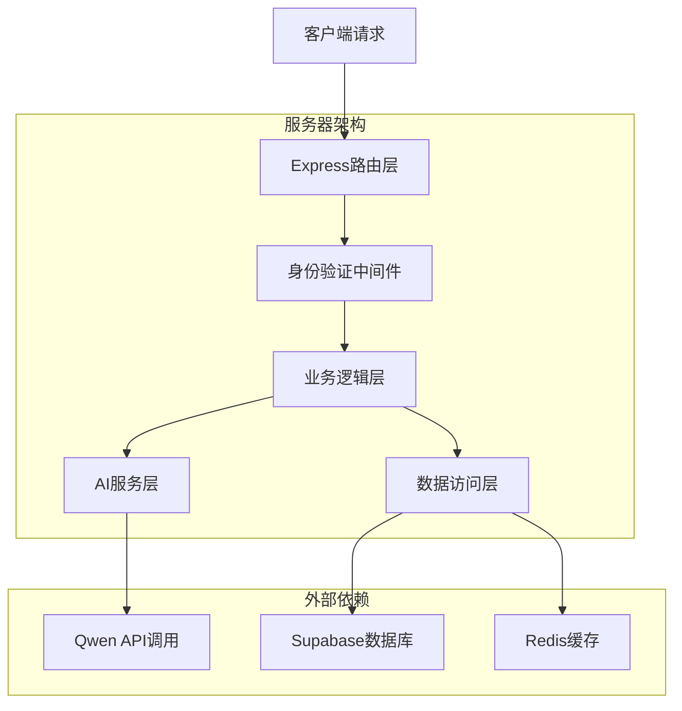
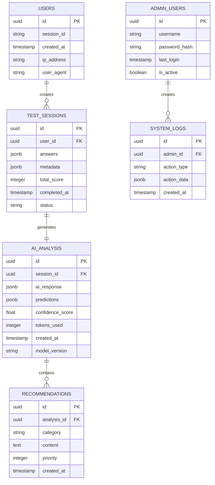

## 1. Architecture design



## 2. Technology Description

* Frontend: React\@18 + TypeScript + TailwindCSS + Vite

* Backend: Node.js\@18 + Express\@4 + TypeScript

* Database: Supabase (PostgreSQL)

* Cache: Redis\@7

* AI Service: Qwen/Qwen3-8B via SiliconFlow API

* Deployment: Vercel (Frontend) + Railway (Backend)

## 3. Route definitions

| Route            | Purpose            |
| ---------------- | ------------------ |
| /                | 登录页面，密码验证和用户身份确认   |
| /test            | 智能测试页面，30题问卷和数据收集  |
| /result          | AI分析结果页面，展示个性化分析报告 |
| /admin           | 管理后台页面，数据统计和系统配置   |
| /api/auth        | 用户身份验证API          |
| /api/test/submit | 提交测试数据API          |
| /api/ai/analyze  | AI分析处理API          |
| /api/admin/stats | 管理数据统计API          |

## 4. API definitions

### 4.1 Core API

**用户测试提交**

```
POST /api/test/submit
```

Request:

| Param Name | Param Type | isRequired | Description      |
| ---------- | ---------- | ---------- | ---------------- |
| answers    | object     | true       | 用户答题数据，包含30道题的答案 |
| metadata   | object     | false      | 答题行为数据（时间、修改次数等） |
| sessionId  | string     | true       | 用户会话标识           |

Response:

| Param Name    | Param Type | Description |
| ------------- | ---------- | ----------- |
| success       | boolean    | 提交状态        |
| analysisId    | string     | 分析任务ID      |
| estimatedTime | number     | 预估分析时间（秒）   |

Example:

```json
{
  "answers": {
    "q1": 4,
    "q2": 6,
    "q3": 3
  },
  "metadata": {
    "totalTime": 1200,
    "modifications": 5
  },
  "sessionId": "sess_123456"
}
```

**AI分析结果获取**

```
GET /api/ai/analyze/{analysisId}
```

Request:

| Param Name | Param Type | isRequired | Description |
| ---------- | ---------- | ---------- | ----------- |
| analysisId | string     | true       | 分析任务ID      |

Response:

| Param Name      | Param Type | Description                   |
| --------------- | ---------- | ----------------------------- |
| status          | string     | 分析状态：pending/completed/failed |
| result          | object     | AI分析结果                        |
| predictions     | object     | 分数预测结果                        |
| recommendations | array      | 个性化建议列表                       |

**Qwen模型调用**

```
POST /api/ai/qwen
```

Request:

| Param Name   | Param Type | isRequired | Description                        |
| ------------ | ---------- | ---------- | ---------------------------------- |
| prompt       | string     | true       | 构建的分析提示词                           |
| userData     | object     | true       | 用户测试数据                             |
| analysisType | string     | true       | 分析类型：score/recommendation/detailed |

Response:

| Param Name | Param Type | Description |
| ---------- | ---------- | ----------- |
| aiResponse | string     | AI模型返回的分析结果 |
| confidence | number     | 分析置信度       |
| tokens     | number     | 消耗的token数量  |

## 5. Server architecture diagram



## 6. Data model

### 6.1 Data model definition



### 6.2 Data Definition Language

**用户会话表 (users)**

```sql
-- 创建用户表
CREATE TABLE users (
    id UUID PRIMARY KEY DEFAULT gen_random_uuid(),
    session_id VARCHAR(255) UNIQUE NOT NULL,
    created_at TIMESTAMP WITH TIME ZONE DEFAULT NOW(),
    ip_address INET,
    user_agent TEXT
);

-- 创建索引
CREATE INDEX idx_users_session_id ON users(session_id);
CREATE INDEX idx_users_created_at ON users(created_at DESC);
```

**测试会话表 (test\_sessions)**

```sql
-- 创建测试会话表
CREATE TABLE test_sessions (
    id UUID PRIMARY KEY DEFAULT gen_random_uuid(),
    user_id UUID REFERENCES users(id),
    answers JSONB NOT NULL,
    metadata JSONB DEFAULT '{}',
    total_score INTEGER,
    completed_at TIMESTAMP WITH TIME ZONE DEFAULT NOW(),
    status VARCHAR(20) DEFAULT 'completed' CHECK (status IN ('pending', 'completed', 'failed'))
);

-- 创建索引
CREATE INDEX idx_test_sessions_user_id ON test_sessions(user_id);
CREATE INDEX idx_test_sessions_completed_at ON test_sessions(completed_at DESC);
CREATE INDEX idx_test_sessions_status ON test_sessions(status);
```

**AI分析结果表 (ai\_analysis)**

```sql
-- 创建AI分析表
CREATE TABLE ai_analysis (
    id UUID PRIMARY KEY DEFAULT gen_random_uuid(),
    session_id UUID REFERENCES test_sessions(id),
    ai_response JSONB NOT NULL,
    predictions JSONB DEFAULT '{}',
    confidence_score FLOAT CHECK (confidence_score >= 0 AND confidence_score <= 1),
    tokens_used INTEGER DEFAULT 0,
    created_at TIMESTAMP WITH TIME ZONE DEFAULT NOW(),
    model_version VARCHAR(50) DEFAULT 'Qwen/Qwen3-8B'
);

-- 创建索引
CREATE INDEX idx_ai_analysis_session_id ON ai_analysis(session_id);
CREATE INDEX idx_ai_analysis_created_at ON ai_analysis(created_at DESC);
CREATE INDEX idx_ai_analysis_confidence ON ai_analysis(confidence_score DESC);
```

**建议表 (recommendations)**

```sql
-- 创建建议表
CREATE TABLE recommendations (
    id UUID PRIMARY KEY DEFAULT gen_random_uuid(),
    analysis_id UUID REFERENCES ai_analysis(id),
    category VARCHAR(50) NOT NULL,
    content TEXT NOT NULL,
    priority INTEGER DEFAULT 1 CHECK (priority >= 1 AND priority <= 5),
    created_at TIMESTAMP WITH TIME ZONE DEFAULT NOW()
);

-- 创建索引
CREATE INDEX idx_recommendations_analysis_id ON recommendations(analysis_id);
CREATE INDEX idx_recommendations_category ON recommendations(category);
CREATE INDEX idx_recommendations_priority ON recommendations(priority DESC);
```

**权限设置**

```sql
-- 授予基础权限
GRANT SELECT ON users TO anon;
GRANT SELECT ON test_sessions TO anon;
GRANT SELECT ON ai_analysis TO anon;
GRANT SELECT ON recommendations TO anon;

-- 授予认证用户完整权限
GRANT ALL PRIVILEGES ON users TO authenticated;
GRANT ALL PRIVILEGES ON test_sessions TO authenticated;
GRANT ALL PRIVILEGES ON ai_analysis TO authenticated;
GRANT ALL PRIVILEGES ON recommendations TO authenticated;
```

**初始化数据**

```sql
-- 插入测试数据
INSERT INTO users (session_id, ip_address) VALUES 
('test_session_001', '127.0.0.1'),
('test_session_002', '192.168.1.100');

-- 插入示例测试会话
INSERT INTO test_sessions (user_id, answers, total_score) 
SELECT id, '{"q1": 4, "q2": 6, "q3": 3}', 65 
FROM users WHERE session_id = 'test_session_001';
```

